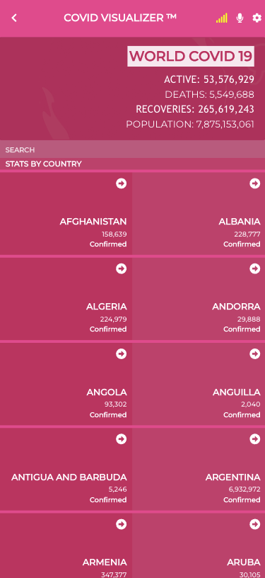
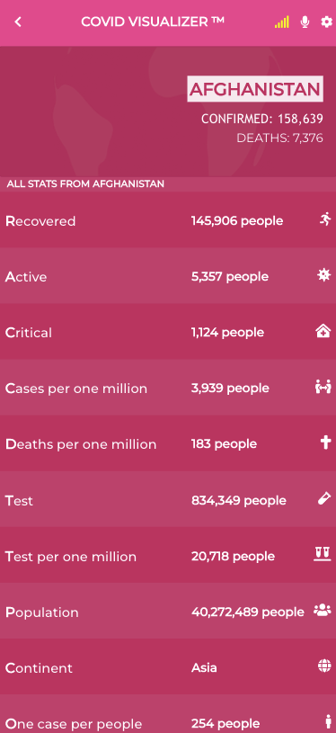

# # Covid Visualizer

Covid visualizer is a simple, interactive way to visualize the impact of COVID-19.
This project use API to retrieve real information of the data about covid-19. The information is divide by countries and first you can see a list of all countries around the world and when you click the detail information will present.

## Built With

- HTML&CSS
- Javascript
- React & Redux

## Live Demo for Mobile Version

- LINK: [Covid-19 Visualizer](https://loving-johnson-43e2f7.netlify.app)

## Video Presentation

- LINK: [Covid-19 Visualizer Presentation](https://www.loom.com/share/3150ed6c84644f53aad2a8e27cabece6)

## Getting Started
To get a local copy up and running follow these simple steps.

## Setup 

### Install
- Open your console and change the current working directory into the destination for this project.
- Type `git clone git@github.com:JasemDuncan/covid-visualizer.git`
- Run this command in terminal: `npm install` to install all dependecies.
- Run this command in terminal: `npm start` to run the project
- Run this command in terminal: `npm test` to see test
- Go in your browser to: http://localhost:3000/

## Authors

👤 **Jasem Duncan Valencia**

- GitHub: [@JasemDuncan](https://github.com/JasemDuncan)
- Twitter: [@JasemDuncan](https://twitter.com/JasemDuncan)
- LinkedIn: [@JasemDuncan](https://www.linkedin.com/in/jasem-duncan-valencia/)
## 🤝 Contributing

Contributions, issues, and feature requests are welcome!

Feel
## Show your support

Give a ⭐️ if you like this project!
## Acknowledgments

- Microverse for the guidelines used for this project
- My SO and project manager, Mane
## 📝 License

This project is [MIT](./LICENSE.md) licensed.

### Creative Commons license of the design
- Original design idea by [Nelson Sakwa](https://www.behance.net/sakwadesignstudio)